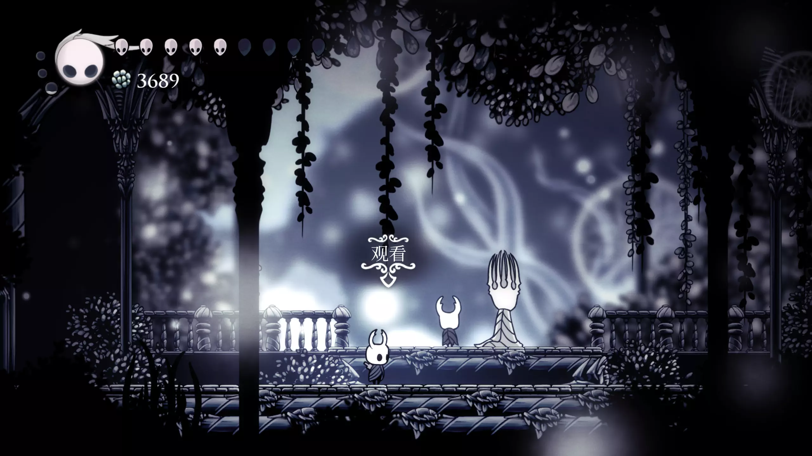
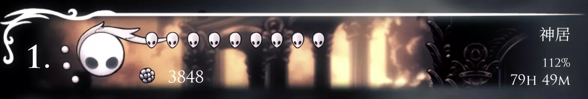

很久之前，大约五六年前左右，应该是在我还在高中期间，就在机房的时候听过《空洞骑士》这个名字，不过那个时候我还是一名信息学竞赛学生，所以当时并没有时间接触这款游戏。

直到今年的 9 月《空洞骑士：丝之歌》的发售后，我才回想起有这么一部被我遗忘的神作，不过介于当时我还在考研备考期间，所以当时也没有直接游玩。一直来到了考研结束后，我开启了自己的首次圣巢之旅。

## 遗忘十字路

从呼啸悬崖跳下来的时候我挺意外这游戏居然没有摔落伤害，就感觉这个游戏可能挺亲切的（？）。毕竟只听说过这个游戏苦痛之路的难度很高，但是对主线的难度并没有一个了解。

来到德特茅斯，一座凄凉的小镇，遇到了第一个能够对话的 npc 老爷爷，老爷爷的话中就感觉到了空洞骑士的故事是通过碎片化信息构建出来的，从他的口中得知了这个小镇的摔落和井下存在一个未知的世界。

从井落下后，来到了十字路，十字路给我的感觉和德特茅斯差不多，凄凉组成了场景的主基调，这个场景中有一些隐藏道路，这个时候我完全没有意识到要打墙开路，所以丢了很多隐藏。

boss 方面，我是先打格罗兹之母再打的假骑士，这两个的机制感觉都比较简单。

## 苍绿之径

初入苍绿之径，游戏画面变得非常得生机勃勃，暗淡的色调中带着绿意，搭配上优秀的旋律，在所有的场景中，苍绿之径的初见让我感到最眼前一亮。

在这里初识大黄蜂，打完大黄蜂拿到小骑士的第二个技能冲刺。大黄蜂在苍绿之径、王国边境的招式有所不同，这应该也是 tc 告诉玩家在小骑士的旅途中，大黄蜂也在一直成长吧。

误入石之庇护所，这里很暗，所以需要凑吉欧买灯。然后就被阴间 boss——无眼给阴间到了，我还记得需要先过一段小跳跳乐，然后被关在了无眼的房间里，无眼的 bgm 挺阴间的，这个 boss 的打法完全就是狗住（最下面那个平台的中间是安定点）。

## 真菌荒地

真菌荒地有两个印象深刻的点：首次知道了下劈和富有节奏的 boss 战——三螳螂。

真菌荒地有那种紫色的蘑菇，很多地点用一段跳是跳不上去的，所以那个时候就了解到了下劈这个机制。下劈这个机制贯彻了后面全部过程，下劈可以刷新除一段跳外的全部位移，在真菌荒地的下劈精度要求不高，而且也不致死，到了白宫的跳跳乐就需要对下劈的节奏和精度有一定的掌握了。

三螳螂的 boss 战非常的有节奏，我依旧记着螳螂的四个招式：横突、竖突、从下往上的飞镖和从上往下的飞镖。三螳螂之所以非常有节奏，我个人的感觉是这个 boss 的前摇非常的长，对于萌新也非常的友好。

## 水晶山峰

水晶山峰很多的路非常的暗，刚需商店买的灯，我一开始误闯了几次但是被黑暗给劝退了。

在这里遇到了第一个狙击手，发射水晶的蚊子，对于萌新的我来说那个蚊子在我跑图的过程中造成了不小的麻烦，特别是拿超冲的那段跑酷，有一段向右上的路有两三只狙击手，脚底下的板是会翻转的，所以那一段特别容易死。

## 泪水之城（上）

真菌荒地过来，应该是来到了泪水之城的左半城（也有可能是我没找到去右半城的路），泪水之城应该是我继苍绿之径后非常喜欢的场景。

去往灵魂圣所的路是一个向上的一条路，有那个会放追踪光球的灵魂小师，这个灵魂小师如果有两个就会非常的难搞，地里也会出现泥巴怪，所以那一段路也不是很和平。

灵魂大师我稍微卡了一下，其实也是一个背板 boss：围绕一圈光球横冲、低空横冲和瞬移的间隙放追踪光球。不过这个 boss 后面有一个偷袭的连续俯冲，灵魂大师可真会假死啊。

## 泪水之城后

泪水之城后，能够探索的路线就非常多样了，我的路线是先安息之地、王国边境、泪水之城右半城、古老盆地、深渊、王后花园、深邃巢穴和皇家水道。

在完成了这些大部分的场景后，小骑士其实就基本拿到了全部的能力，后面的部分我意识到我很多的东西都忘记收集了，特别是幼虫，所以我就去照着攻略基本上收集了一遍。

这个阶段，我还去打了格林，格林这个 boss 我非常的喜欢，特别是梦魇之王格林的形态。

这边就说说王格林吧，王格林普通招式有五种：

1. 掀披风放四个横冲的光球。我的解法是两次有间隔的跳加一个冲刺，可以贪三刀。
2. 全屏地刺。这个都是找个间隔躲，我记得普通格林这个时候可以贪刀，王格林这个时候不可以贪刀。
3. 斜向下突刺再接一个横冲。这个招式我可以在横冲的时候下劈贪一刀。
4. 横冲接一个斜向上突刺，然后在空中放火球落地。这个招式基本在格林底下左右一点就可以躲。
5. 追踪火柱。这个招式普通格林是没有的，我是在其中一个火柱快要消失的时候加一个黑冲，可以来回躲，而且这个招式可以偷比较多的刀。但是这个招式偷刀很可能撞上格林，王格林是二伤的，所以我只在比较有把握的时候才会在这个招式时候贪刀。

王格林前摇比较短，而且容易看错前摇，王格林的某些招式是带有随机的后撤步的，所以在打这个 boss 的时候是需要专注注意力，这个 boss 虽然卡了我一段时间，但是我还是打的很开心。

## 苍白宫殿和苦痛之路

拿完全部的能力，我才来苍白宫殿这个著名的跳跳乐地点。对于我个人而来，这个游戏最初吸引我的点，其实就是白宫和苦痛之路。很早以前我就从高中同学那听到过苦痛之路的大名，我是一个在游戏中挑战自己的人（不过不是一个极限玩家），所以我就一直非常想尝试一下这个跳跳乐。

白宫的路线于我而言其实就有一点难度了，因为我并没有横版游戏跳跳乐的经历，只有在苍绿之径和王后花园的跳跳乐的经验。整条路上其实有很多技巧，比如说下劈的时机、超冲的释放时机等等，很多跳到最后都变成了肌肉记忆。

苦痛之路的话，我印象最深刻的还是 r1 和 r4。先说说 r1，先是一个右向上蹭跳躲电锯，然后两个下劈虫子加寸止超冲，然后我是选择钻左下角缝的路线，这一段路线上的练习让我能够比较好的衔接上下劈，我经常在下劈虫子的时候按不出下劈或者下劈的节奏不对，这一段跑的挺折磨的，钻缝也需要看自己的手感，个人感觉容错率还是挺低的（上面的路线没有试过），然后是下坠躲电锯，这段路不能乱在空中冲刺，也需要把握好下劈的节奏，可以下劈调整下去的位置。

r2 整体比较简单，r3 的前半段非常像苍绿之径和王后花园的某些跳跳乐，这个路径类似是跑过的，所以也不算特别难。

r4 的前半段是一段向上的路，我的路线是靠右边找电锯的时机劈上升的电锯上去，这一段也是跑多了就有肌肉记忆了。最后一段的下劈电锯也卡了我很长时间，因为那个刺是需要找节奏的，所以需要练，在劈刺练的差不多后劈电锯应该是比较简单的事，不过需要加上左右移动这个也需要找节奏。最后最难的一段，下面一个电锯左右快速移动，需要冲刺钻过一个缝然后二段跳接侧边的下劈到上面的电锯上，然后找下面电锯到右边的时刻下劈接冲刺钻过两个电锯。

整段苦痛之路我跑的挺累的，中间还为了防止退出而失去进度，把电脑挂了一整晚，不过跳下来确实非常的爽。

## 前辈与主线幅光

前辈的难度比较简单，前摇很长比神居的纯粹容器要简单不少。

主线幅光我是第一个阶段卡的比较多，也就是有平台的时候卡了，机器学习ing（乐。二阶段在七个平台上的作战我都躲的比较好，第三阶段的躲狙击加爬楼梯我是一遍过的，所以主线幅光我过的还算比较顺利。

神居的话，就是每个 boss 背板加肌肉记忆，这个过程还是蛮痛苦的，如果倒在最后一个 boss 重新打一遍就要花费 10min 左右的时间。不过最后还是完成了 112% 的完成度。

最后附上一张存档的截图：

